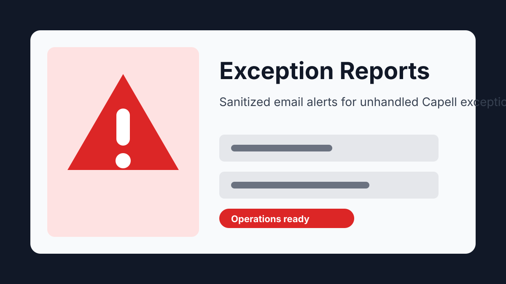
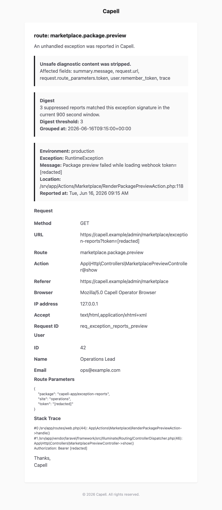

# Exception Reports

<!-- prettier-ignore-start -->

## What This Plugin Adds

Exception Reports is an **Available**, **No schema impact** Capell package in the **Capell Operations** product group. It ships as `capell-app/exception-reports` and extends these surfaces: console, shared.

Exception Reports emails operators when Capell reports an unhandled exception, including sanitized app, request, route, user, and stack-trace context that is safe to read in an email client.

After install, the package is operated through console commands or background maintenance hooks.

Status details:

- Status: Available
- Tier: free
- Bundle: operations
- Composer package: `capell-app/exception-reports`
- Namespace: `Capell\ExceptionReports`
- Theme key: not applicable

## Why It Matters

**For developers:** The package gives developers package-owned service providers, Actions, Data objects, and Blade views instead of pushing this behaviour into core or application code.

**For teams:** Email and optional webhook alerting for unhandled Capell exceptions, with request, route, user, and stack-trace context sanitized for safe operator triage.

## Screens And Workflow

Screenshot contract: `docs/screenshots.json`.

- Exception Reports extension card (marketplace, required).
- Exception Reports rendered email preview (email, required).

## Technical Shape

- Service providers: `Capell\ExceptionReports\Providers\ExceptionReportsServiceProvider`.
- Config files: `packages/exception-reports/config/capell-exception-reports.php`.
- Actions: `QueueRateLimitedExceptionDigestAction`, `ReportExceptionByEmailAction`, `SendExceptionReportWebhookAction`.
- Data objects: `ExceptionReportData`, `ResolvedExceptionReportWebhookEndpointData`.
- Manifest contributions: `health-check: Capell\ExceptionReports\Health\ExceptionReportsHealthCheck`.
- Health checks: `Capell\ExceptionReports\Health\ExceptionReportsHealthCheck`.
- Blade views: `packages/exception-reports/resources/views/mail/reported.blade.php`.

## Data Model

This package has no schema impact. It does not declare package-owned migrations or required tables.

Docs gap: document extension points here if the package delegates persistence to a host package.

## Install Impact

- Admin navigation: no admin surface declared.
- Permissions: none declared in `capell.json`.
- Public routes: none detected in package route files.
- Database changes: no package migrations declared.
- Settings: no package settings declared.
- Queues or schedules: none detected in standard package paths.
- Cache tags: none declared.
- Commands: none declared.

## Common Pitfalls

- Run package commands from the host app; in this repository use `vendor/bin/pest` for package tests.
- Keep `composer.json`, `composer.local.json`, `capell.json`, docs, screenshots, and tests aligned when the package surface changes.

## Troubleshooting

| Symptom | Likely cause | Check | Fix |
| --- | --- | --- | --- |
| Package surface is missing after install | Provider or manifest is not loaded | Confirm `capell.json`, package `composer.json`, and provider registration | Reinstall the package, refresh Composer autoload, and clear host caches |

## Quick Start

1. Install the package: `composer require capell-app/exception-reports`.
2. Run the required setup: no package migrations are declared; clear cached config and routes if the host app uses caches.
3. Verify the package provider is registered and the related frontend, command, or extension point is active.

## Next Steps

- [Package docs](docs/README.md)
- [Overview](docs/overview.md)
- [Screenshot contract](docs/screenshots.json)
- [Marketplace assets](docs/assets/marketplace/)
- [Capell content language plan](../../docs/CONTENT_LANGUAGE_PLAN.md)
- [Capell documentation design system](../../docs/DESIGN_SYSTEM.md)
- [Capell and package ERD notes](../../docs/erd/capell-and-package-erds.md)
- Related packages: [Diagnostics](../diagnostics/README.md).
- Focused tests: `vendor/bin/pest packages/exception-reports/tests --configuration=phpunit.xml`.

<!-- prettier-ignore-end -->
